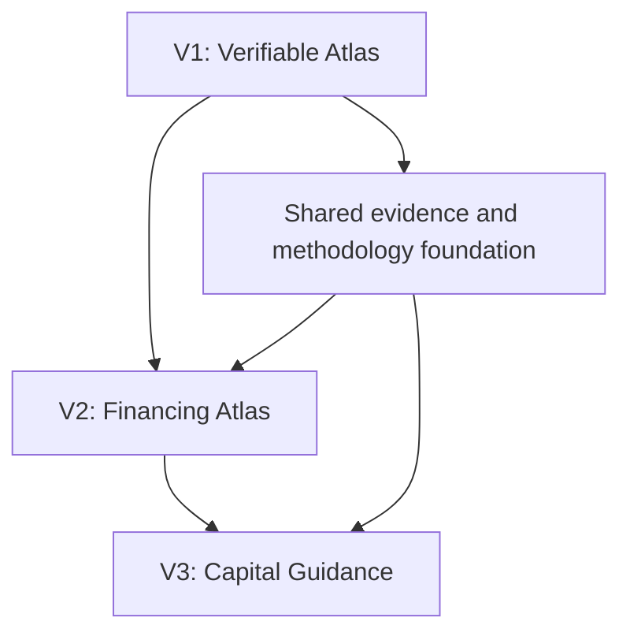

# Verifiable Clean Energy Atlas Requirements

## Summary

Replace the oversized master prompt with a cumulative product-document system that delivers a verifiable energy atlas first, preserves future financing compatibility, and defers capital guidance until the evidence base and product are mature.

---

## Problem Frame

`PROMPT.md` currently combines a global infrastructure atlas, an energy methodology, a financing intelligence product, anti-greenwashing assessments, investment guidance, technical direction, and autonomous execution instructions. The individual safeguards are useful, but their simultaneous presentation gives an implementation agent no reliable release boundary and encourages premature work across all three product stages.

The intended audience also spans journalists, citizens, and energy experts. Journalists need quickly citable claims and evidence; citizens need understandable explanations; experts need raw detail and methodological depth. Without a clear priority, the product risks becoming either too shallow to trust or too dense to use.

Global clean-energy data is heterogeneous. Facility registers, lifecycle classifications, geographic precision, update schedules, national energy balances, and licensing vary substantially by jurisdiction. A single “worldwide” completeness claim would therefore be misleading.

---

## Actors

- A1. Journalist: finds citable energy facts and reaches the underlying methodology and evidence quickly.
- A2. Citizen: understands facilities, country energy shares, uncertainty, and coverage without specialist knowledge.
- A3. Energy expert: inspects definitions, source observations, calculations, limitations, and downloadable data.
- A4. Data steward or researcher: reconciles sources, records uncertainty, validates geography, and publishes verified coverage waves.
- A5. Future financing analyst: later connects ownership and financing information without rebuilding the physical-project foundation.

---

## Key Flows

- F1. Explore a geography
  - **Trigger:** A1, A2, or A3 selects a supported country, region, or ocean area.
  - **Actors:** A1, A2, A3
  - **Steps:** View coverage status; inspect country energy shares; filter technologies and lifecycle states; select a mapped or unplotted record; review sources and uncertainty.
  - **Outcome:** The user understands both the available evidence and its limits.
  - **Covered by:** R3, R4, R7, R8, R11

- F2. Verify a published claim
  - **Trigger:** A1 or A3 opens a displayed total, percentage, project attribute, or classification.
  - **Actors:** A1, A3
  - **Steps:** Open the calculation explanation; inspect numerator, denominator, period, formula, included records, exclusions, and source observations; download permitted supporting data.
  - **Outcome:** The claim is independently auditable or visibly marked as not fully reproducible.
  - **Covered by:** R9, R10, R12, R13

- F3. Publish a verified coverage wave
  - **Trigger:** A4 has assembled a candidate jurisdiction dataset.
  - **Actors:** A4
  - **Steps:** Reconcile authoritative sources; validate classifications and locations; quantify coverage; record limitations; run quality gates; publish or withhold verified status.
  - **Outcome:** A geography enters the atlas only with an auditable national baseline and explicit gaps.
  - **Covered by:** R5, R6, R14, R15

- F4. Extend toward financing later
  - **Trigger:** The product begins V2 after V1 evidence foundations are stable.
  - **Actors:** A4, A5
  - **Steps:** Reuse stable projects, phases, facilities, organizations, ownership history, sources, and methodology releases; connect financing evidence without changing V1 meanings.
  - **Outcome:** Financing capability accumulates on the verified atlas rather than replacing it.
  - **Covered by:** R1, R2, R16

---

## Requirements

**Product sequence and document system**

- R1. The product must follow a cumulative sequence: V1 Verifiable Atlas, V2 Financing Atlas, then V3 Capital Guidance.
- R2. The current master prompt must become a maintained document system separating stable product principles, V1 requirements, energy and geographic methodology, verification rules, future-finance compatibility, and coverage-wave publication criteria.
- R3. V1 must optimize for journalists first, remain understandable to citizens, and expose deeper evidence and data for energy experts.

**V1 coverage and release model**

- R4. V1 must support the United States, China, every European country, India, Japan, Russia, Australia, available African jurisdictions, and relevant ocean infrastructure.
- R5. Coverage must publish in verified waves rather than waiting for a single global release or presenting all geographies as equally complete.
- R6. A geography may receive verified-wave status only when it has an auditable national baseline: authoritative energy-mix data, authoritative facility sources by relevant technology, measured coverage, reproducible methodology, and visible limitations.
- R7. Every geography and technology must expose coverage status and gaps; the product must never imply completeness from the presence of map markers.
- R8. Ocean records must distinguish territorial waters, exclusive economic zones, high seas, and disputed areas using documented jurisdiction evidence. Proximity alone must never determine national attribution.

**Verification and methodology**

- R9. Clean-energy classification must use four explicit states: eligible, conditional, excluded, and unknown.
- R10. Each classification must expose supporting lifecycle-emissions evidence, including sourced ranges where available, rather than relying on labels or operational emissions alone.
- R11. Country profiles must keep electricity generation share, installed capacity share, total energy supply, and final energy consumption distinct and must show period, numerator, denominator, unit, definition, and source.
- R12. Every headline energy claim must support a trace from displayed value to calculation, constituent records, field-level observations, and original sources when licensing permits.
- R13. Methodologies, datasets, source snapshots, change history, corrections, limitations, and calculation rules must be versioned and publicly understandable.

**Data quality and publication integrity**

- R14. Uncertain locations must remain searchable but unplotted; city centers, administrative centroids, company offices, and guessed coordinates are prohibited substitutes.
- R15. Conflicting, stale, incomplete, or non-comparable evidence must remain visible and must lower coverage or confidence rather than being silently resolved into certainty.

**Future financing compatibility**

- R16. V1 must preserve stable distinctions and histories for physical facilities, projects, project phases, organizations, ownership, jurisdictions, evidence, and methodology versions so V2 financing data can attach without redefining V1 records.
- R17. V1 user-facing surfaces must exclude financing transactions, funding opportunities, investment rankings, and capital recommendations.
- R18. Future financing compatibility must not delay a geography's V1 release unless a V1 energy claim itself depends on ownership or organizational evidence.

---

## Acceptance Examples

- AE1. **Covers R5, R6, R7.** Given that the United States passes the national baseline while one African country has only a partial project list, the United States may appear as verified and the African country remains visibly partial rather than inheriting verified status.
- AE2. **Covers R8.** Given an offshore project inside a disputed maritime area, the map displays the dispute and evidence source and does not assign the project to the nearest country as fact.
- AE3. **Covers R9, R10.** Given a biomass facility with unclear feedstock and transport evidence, its classification is conditional or unknown, never eligible by default.
- AE4. **Covers R11, R12.** Given a country card showing 72% clean electricity, opening the calculation reveals the reporting year, clean-generation numerator, total-generation denominator, technology treatment, formula, and sources.
- AE5. **Covers R14.** Given a verified facility name and municipality but no reliable site coordinates, the record appears in search and totals as unplotted and no municipality centroid is placed on the map.
- AE6. **Covers R16, R17, R18.** Given that a V1 project has known owners but no financing data, the project may publish with its sourced ownership history; no empty investment interface appears, and financing can be attached later without replacing the project identity.

---

## Success Criteria

- A journalist can cite a country share or facility fact and reach its formula, limitations, and original evidence without specialist assistance.
- A citizen can distinguish verified, conditional, excluded, unknown, partial, and unplotted states without interpreting raw methodology.
- An energy expert can reproduce or challenge published aggregates from versioned methods and permitted source data.
- No geography receives verified status without satisfying and exposing the national-baseline criteria.
- Planning can restructure the product prompt without inventing the V1 boundary, audience priority, geographic scope, release model, clean classification, ocean treatment, or financing deferral.
- V2 can add financing relationships without redefining facility, project, source, temporal, or verification concepts established for V1.

---

## Scope Boundaries

### Deferred for later

- Financing transactions, lenders, investors, financial instruments, and funding gaps in the product interface.
- Anti-greenwashing assessment of investable opportunities.
- Project rankings by financing need, impact, return, or risk.
- Citizen or organizational capital guidance.
- Regulated investment access or money movement.
- Specialized multi-agent research and ingestion orchestration beyond what V1 delivery requires.

### Outside this product's identity

- Paid placement or sponsored verification.
- Personalized financial advice or guaranteed impact or returns.
- Arbitrary jurisdiction attribution for offshore or disputed projects.
- Claims of global exhaustiveness unsupported by measured source coverage.
- A generic promotional marketplace for products labeled green.

---

## Key Decisions

- Journalist-first information design: citable evidence is the hardest shared requirement; citizen clarity and expert depth layer around it.
- Verified waves over simultaneous global publication: source quality varies too much for one honest completeness claim.
- Auditable national baseline over individual verification of every facility: this creates a rigorous but achievable release gate.
- Four-state clean classification over a universal emissions threshold or local taxonomies: it preserves uncertainty and cross-country interpretability.
- Document system over a single master prompt: stable principles, V1 scope, methods, and future constraints change at different rates.
- Financing-ready but financing-free V1: structural compatibility is required; finance-facing behavior is deferred.

---

## Dependencies / Assumptions

- Authoritative national and international sources exist with enough coverage and legal usability to establish at least one initial verified wave.
- Some target jurisdictions will remain partial for extended periods; this is acceptable when gaps are explicit.
- Lifecycle-emissions ranges may be technology-level rather than facility-specific; the evidence level must remain visible.
- The existing `PROMPT.md` is source material, not the final document structure.

---

## Outstanding Questions

### Deferred to Planning

- [Affects R2][Technical] What exact document boundaries and execution order best keep the prompt system maintainable?
- [Affects R4, R5][Needs research] What release-wave order provides the fastest high-quality geographic coverage across the selected regions?
- [Affects R6, R13][Needs research] Which authoritative source set and licensing constraints apply to each target geography and technology?
- [Affects R9, R10][Needs research] Which lifecycle-assessment references and evidence hierarchy should govern each technology category?
